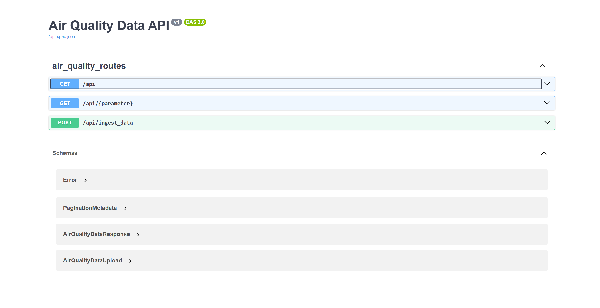

Here’s a structured and professional README file template for your project. It includes all the requested details and is designed to be comprehensive and visually appealing.

---

# Air Quality Visualization Project

A full-stack application for visualizing air quality data. This project includes a backend service for data management and a frontend dashboard for interactive data visualization.

---

## **Project Architecture**

---

## **Technologies Used**

### **Frontend (Angular 19)**
- **Framework:** Angular 19 (LTS)
- **Features:** 
  - Interactive charts using a charting library (ngx-Echarts).
  - Modern Angular features like standalone components and signals.
- **Development Environment:** Node.js 22.11-alpine.

### **Backend (Flask)**
- **Framework:** Flask
- **APIs:** RESTful APIs with Flask-Smorest.
- **Documentation:** API documented using Swagger (OpenAPI 3.0.3).
- **Database Interaction:** PyMongo.
- **Environment Variables:** Configured via `.env` file.

### **Database (MongoDB)**
- **Type:** NoSQL Database.
- **Indexes:** Optimized for fast data retrieval using compound indexes.
- **Data Model:** Stores time-series air quality data.

### **Dockerization**
- **Container Orchestration:** Docker Compose.
- **Services:**
  - **MongoDB** for data storage.
  - **Backend** for API endpoints.
  - **Frontend** for user interaction.
- **Development Workflow:** Live reload using volume binding in containers.

---

## **API Documentation**

The API is documented using **Swagger**. You can access the interactive API documentation at:
```
http://localhost:5000/swagger-ui
```
Or simply navigate to the root URL of the backend API and it will redirect you to the Swagger UI page.
```
http://localhost:5000
```

Here are some snapshots of the API documentation:


---

## **Getting Started**

### **Setup**

1. **Clone the Repository**
   ```bash
   git clone https://github.com/your-repo-url.git
   cd air-quality-visualization
   ```

2. **Environment Variables**
   Find `.env` file in the root directory with the following content, and feel free to modify as per your requirements.
   ```env
   FLASK_ENV=development
   FLASK_DEBUG=1
   FLASK_APP=run.py
   FLASK_PORT=5000

   DASHBOARD_PORT=3000

   MONGO_HOST=mongo
   MONGO_PORT=27017
   MONGO_DB_NAME=air_quality
   MONGO_USERNAME=root
   MONGO_PASSWORD=my-pass
   MONGO_AUTH_SOURCE=admin
   ```

---

### **Run the Project**

1. **Build and Start Services**
   ```bash
   docker-compose up --build
   ```

2. **Access the Application**
   - **Backend API:** [http://localhost:5000](http://localhost:5000)
   - **Frontend Dashboard:** [http://localhost:3000](http://localhost:3000)

---

## **How to Use**

### **Frontend Dashboard**

#### **Interactive Dashboard**
- Navigate to the **Dashboard**: [http://localhost:3000](http://localhost:3000).
- **Select Parameters:** Use the dropdown to select air quality parameters (e.g., CO, Benzene).
- **Filter Data:** Use the date range picker to filter data.

#### **Sample Snapshots**


### **API Endpoints**

#### **Available Endpoints**
| Endpoint                        | Method | Description                                    |
|---------------------------------|--------|------------------------------------------------|
| `/api/air-quality`                  | `GET`  | Fetch api/air quality data for a date range.       |
| `/api/air-quality/<parameter>`      | `GET`  | Fetch data for a specific parameter.           |
| `/api/air-quality/ingest_data`      | `POST` | Bulk upload air quality data via CSV.          |

#### **Request Example**
```bash
curl -X 'GET' "http://localhost:5000/api/air-quality?start_date=20-10-2004&end_date=30-10-2004" \ 
    -H 'accept: application/json'
```

#### **Response Example**
```json
[
    {
        "timestamp": "2023-01-01T00:00:00",
        "CO_GT": 1.2,
        "Benzene": 0.5,
        "NO2": 2.3
    },
    ...
]
```

### **Data Ingestion**
#### **Upload Data via CSV**
- Upload air quality data in bulk using the `/api/air-quality/ingest_data` endpoint.
- Use the Swagger UI for easy data upload.
- **CSV File:** Sample CSV file is available at `backend/dataset/AirQualityUCI.csv`.

---

## **Contributing**

We welcome contributions to improve this project. Please fork the repository and create a pull request.

---

## **Acknowledgments**

- **Frontend Design:** Leveraging Angular 19 with advanced features.
- **Backend API:** Flask-Smorest for seamless API management.
- **Database:** MongoDB for efficient data handling.
- **Docker:** Simplified deployment and scalability.

---

Let me know if you need any modifications or additional sections!